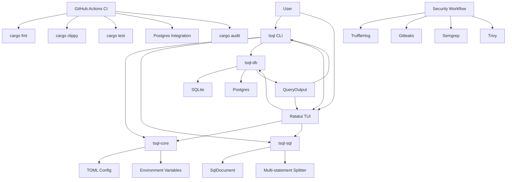

# TSQL Architecture Graph



## Dependency Direction

```text
tsql-app -> tsql-core, tsql-sql, tsql-db, tsql-tui
tsql-tui -> tsql-core, tsql-sql, tsql-db
tsql-db  -> tsql-core, tsql-sql
tsql-sql -> no internal crates
tsql-core -> no internal crates
```

## Release Gate

```text
feature branch -> PR -> required CI/security -> owner review -> merge main -> tag v0.1.0 -> manual release workflow
```
